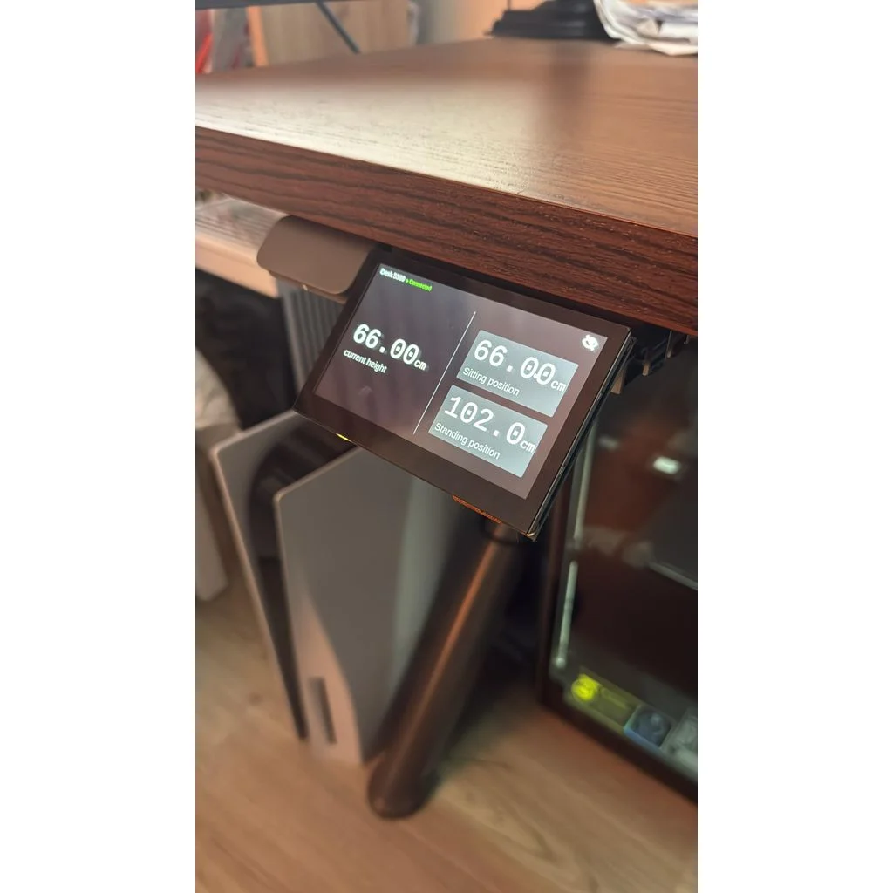

# Idasen‑Desk‑Controller

<p align="center">

</p>

Local touchscreen interface for the IKEA Idasen sit/stand desk.  
Runs on a Raspberry Pi and controls the desk over Bluetooth LE through a minimal Flask + WebSocket backend.  
Designed around a Waveshare 4.3″ 800 × 480 screen mounted in a custom 3‑D printed bracket.

---

## Folder layout

```
eye.svg      # icon for the UI  
index.html   # frontend (inline CSS + JS)  
server.py    # Flask WebSocket backend
```

---

## How it works

| Layer          | Description |
|----------------|-------------|
| **idasen**     | Python library that handles BLE; exposes `get_height()` and `move_to_target()`. Protocol details: <https://github.com/newAM/idasen>. |
| **server.py**  | Starts Flask on **0.0.0.0:8000**.<br>• `GET /` serves the UI.<br>• `WS /ws` streams height (cm) and accepts `{"action":"move","target":"sit"|"stand"}`.<br>• `POST /backlight` writes to `/sys/class/backlight/<device>/bl_power` (`0` = on, `1` = dim). |
| **index.html** | Connects to `/ws`, shows current height, and offers two preset buttons. The eye icon overlays a black pane and calls `/backlight` to dim or restore the panel. |

### Changing the sit / stand positions

Edit the `POSITIONS` dictionary near the top of **server.py** (values in centimetres):

```python
POSITIONS = {
    "sit":   0.66,   # 66 cm
    "stand": 1.02    # 102 cm
}
```

Restart the server after any change.

---

## Hardware

* Raspberry Pi 4 (Pi OS Bookworm, Wayland)
* Waveshare 4.3″ 800 × 480 DSI touchscreen (other screens require CSS & mount changes)
* IKEA Idasen desk (Bluetooth LE)

The printable mount (STL + Fusion 360 source) is available on **[Thingiverse](https://www.thingiverse.com/thing:7103519)**.

---

## Installation

```bash
git clone https://github.com/adamdrhy/idasen-desk-controller.git
cd idasen-desk-controller
python3 -m venv venv
source venv/bin/activate
pip install flask flask-sock idasen
```
> ⚠️ **Important:** Before running the server for the first time, complete the **Configuration** section below.

**Run the backend as root** (`sudo`) or back‑light control will fail.

## Configuration

Before running the application, edit the MAC_ADDRESS constant near the top of `server.py` and replace the placeholder Bluetooth MAC address with the MAC address of your own IKEA IDÅSEN desk:

```python
MAC_ADDRESS = "YOUR_IDASEN_MAC_ADDRESS"
```

For example:

```python
MAC_ADDRESS = "AA:BB:CC:DD:EE:FF"
```

If you do not know your desk's Bluetooth MAC address, follow the discovery instructions provided by the `idasen` library:

https://github.com/newAM/idasen

Save the file before starting the server.

### Manual test

```bash
sudo ./venv/bin/python server.py
# then on the Pi open:
http://127.0.0.1:8000
```

---

## Boot integration (systemd)

Create `/etc/systemd/system/flask.service`:

```ini
[Unit]
Description=Idasen Flask Server
After=network.target bluetooth.target

[Service]
ExecStart=/home/pi/idasen-desk-controller/venv/bin/python          /home/pi/idasen-desk-controller/server.py
WorkingDirectory=/home/pi/idasen-desk-controller
Restart=always
User=root

[Install]
WantedBy=multi-user.target
```

Create `/etc/systemd/system/kiosk.service`:

```ini
[Unit]
Description=Chromium Kiosk
After=flask.service graphical.target
Requires=flask.service

[Service]
Environment=XDG_SESSION_TYPE=wayland
ExecStart=/usr/bin/chromium-browser   --kiosk --app=http://127.0.0.1:8000   --noerrdialogs --disable-session-crashed-bubble   --incognito --no-first-run --no-cursor
Restart=always
User=pi

[Install]
WantedBy=graphical.target
```

Enable and reboot:

```bash
sudo systemctl daemon-reload
sudo systemctl enable flask.service
sudo systemctl enable kiosk.service
sudo reboot
```

---

## Back‑light behaviour

Waveshare panels only support `bl_power` 0 (on) and 1 (dim).  
Full power‑off is not possible in software; the UI covers the screen with a black overlay and sets `bl_power` to 1 for minimal brightness.

---

## License

MIT
